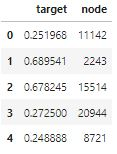
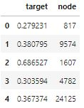
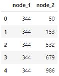
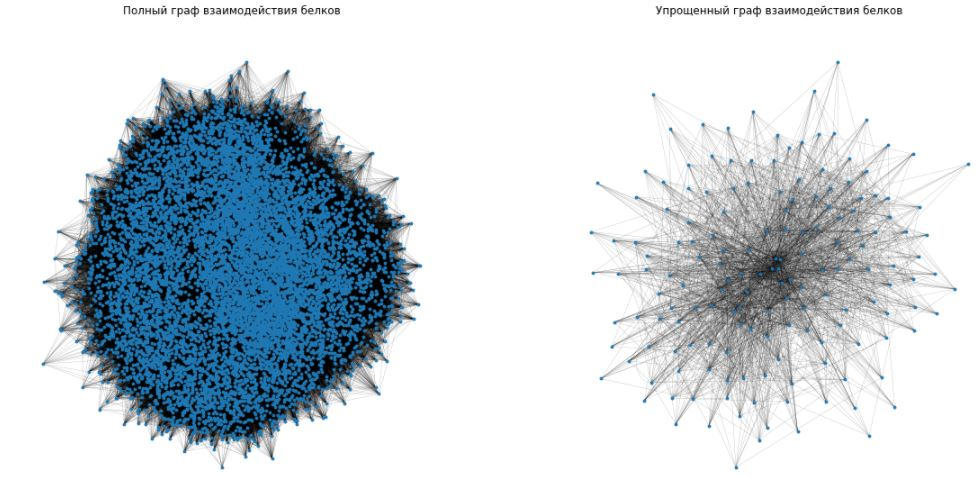
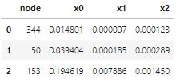
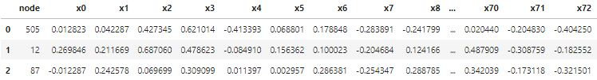

# Предсказание уровня экспрессии белка
Построить модель предсказания экспрессии белков.

## Подключение библиотек
```python
# Импорт основных библиотек
import numpy as np
import pandas as pd

# Импорт библиотеки по изучению сетевых структур
import networkx as nx

# Импорт библиотеки обработки естественного языка
from gensim.models import Word2Vec

# Импорт библиотек машинного обучения
from sklearn.model_selection import train_test_split
from sklearn.metrics import mean_squared_error
from lightgbm import LGBMRegressor

# Импорт библиотеки машинного обучения графов
from stellargraph import StellarGraph
from stellargraph.data import BiasedRandomWalk

# Импорт библиотек построения диаграмм и графиков
import matplotlib.pyplot as plt
import seaborn as sns

# Определение режима вывода диаграмм
%matplotlib inline

# Определение стиля вывода диаграмм
plt.rc('axes', grid=True)
plt.rc('grid', linewidth=0.5)
```

## Загрузка исходных данных
```python
# Загрузка обучающего набора данных (уровень экспрессии белков)
protein_train = pd.read_csv('train.csv', low_memory=False)
protein_train.head()
```


```python
# Загрузка тестового набора данных (уровень экспрессии белков)
protein_test = pd.read_csv('test.csv', low_memory=False)
protein_test.head()
```


```python
# Загрузка данных рёбер графа (взаимодействие белков)
protein_edges = pd.read_csv('edges.csv', low_memory=False)
protein_edges.head()
```


## Разведочный анализ
```python
# Вывод размеров обучающей и тестовой выборок
print('Обучающая выборка:{};  Тестовая выборка:{}'.format(protein_train.shape, protein_test.shape))
```
```
Обучающая выборка:(8000, 2);  Тестовая выборка:(2000, 2)
```

```python
# Построение графа NetworkX для отражения структуры взаимодействия белков
protein_graph = nx.from_pandas_edgelist(protein_edges, 'node_1', 'node_2')
print('Узлов: {};  Рёбер: {}'.format(protein_graph.number_of_nodes(), protein_graph.number_of_edges()))
```
```
Узлов: 10000;  Рёбер: 594174
```

```python
# Определение схемы вывода диаграмм
fig, axes = plt.subplots(1, 2, figsize=(20, 10))

# Вывод полного графа взаимодействия белков
nx.draw_spring(protein_graph, node_size=15, width=0.1, linewidths=0, ax=axes[0])

# Вывод сокращенного варианта графа на основе степени важности узлов
degree_centrality = pd.Series(nx.degree_centrality(protein_graph))
subgraph = protein_graph.subgraph(degree_centrality[degree_centrality > 0.06].index)
nx.draw_spring(subgraph, node_size=15, width=0.1, linewidths=0, ax=axes[1])

# Вывод заголовков диаграмм
axes[0].set_title('Полный граф взаимодействия белков')
axes[1].set_title('Упрощенный граф взаимодействия белков')

# Отображение диаграмм
plt.show()
```


## Предобработка данных
### Извлечение признаков с помощью NetworkX
```python
# Извлечение основных признаков узлов из графа (степень важности, посредничества, рейтинг узла)
degree_centrality = pd.Series(nx.degree_centrality(protein_graph))
betweenness_centrality = pd.Series(nx.betweenness_centrality(protein_graph, k=30))
pagerank = pd.Series(nx.pagerank(protein_graph))

# Вывод размерности признаков
print(degree_centrality.shape, betweenness_centrality.shape, pagerank.shape)
```
```
(10000,) (10000,) (10000,)
```

```python
# Формирование датасета извлеченных признаков
node_features = pd.concat(
    [degree_centrality, betweenness_centrality, pagerank], axis=1
).reset_index()

node_features.columns = ['node'] + ['x' + str(i) for i in range(3)]

# Вывод извлеченных признаков
node_features.head(3)
```


```python
# Объединение обучающего и тестового набора данных с извлеченными признаками
train_data = protein_train.merge(node_features, how='left', on='node')
test_data = protein_test.merge(node_features, how='left', on='node')

# Представление наборов данных в виде обучающей и тестовой выборок
X_train_nx, X_test_nx, Y_train_nx, Y_test_nx = (
    train_data.iloc[:, 2:], test_data.iloc[:, 2:], train_data.iloc[:, 0], test_data.iloc[:, 0]
)

# Вывод размерности выборок
print("Размер Train выборки:", X_train_nx.shape)
print("Размер Test выборки:", X_test_nx.shape)
```
```
Размер Train выборки: (8000, 3)
Размер Test выборки: (2000, 3)
```

### Извлечение признаков с помощью Node2Vec
```python
# Построение графа StellarGraph для генерации вектора признаков (вложений) узлов
protein_sgraph = StellarGraph.from_networkx(protein_graph)
print(protein_sgraph.info())
```
```
StellarGraph: Undirected multigraph
 Nodes: 10000, Edges: 594174

 Node types:
  default: [10000]
    Features: none
    Edge types: default-default->default

 Edge types:
    default-default->default: [594174]
        Weights: all 1 (default)
        Features: none
```

```python
# Генерация корпуса из идентификаторов узлов графа с использованием случайных блужданий
random_walk = BiasedRandomWalk(protein_sgraph, seed=42)
walks = random_walk.run(protein_sgraph.nodes(), n=10, length=30, p=0.5, q=2.0)

# Генерация вектора признаков для каждого узла графа
str_walks = np.array(walks).astype(str).tolist()
w2v_model = Word2Vec(str_walks, vector_size=80, window=5, min_count=0, sg=1)

# Вывод размерности вектора признаков
w2v_model.wv.vectors.shape
```
```
(10000, 80)
```

```python
# Формирование датасета извлеченных признаков
node_features = pd.concat([
    pd.Series(np.array(w2v_model.wv.index_to_key).astype(int)),
    pd.DataFrame(w2v_model.wv.vectors)
], axis=1)

node_features.columns = ['node'] + ['x' + str(i) for i in range(w2v_model.wv.vectors.shape[1])]

# Вывод извлеченных признаков
node_features.head(3)
```


```python
# Объединение обучающего и тестового набора данных с извлеченными признаками
train_data = protein_train.merge(node_features, how='left', on='node')
test_data = protein_test.merge(node_features, how='left', on='node')

# Представление наборов данных в виде обучающей и тестовой выборок
X_train_n2v, X_test_n2v, Y_train_n2v, Y_test_n2v = (
    train_data.iloc[:, 2:], test_data.iloc[:, 2:], train_data.iloc[:, 0], test_data.iloc[:, 0]
)

# Вывод размерности выборок
print("Размер Train выборки:", X_train_n2v.shape)
print("Размер Test выборки:", X_test_n2v.shape)
```
```
Размер Train выборки: (8000, 80)
Размер Test выборки: (2000, 80)
```

## Построение модели
```python
# Определение модели прогнозирования
lgbm_model = LGBMRegressor()

# Построение моделей прогнозирования на основных характеристиках графа 
# (признаки NetworkX) и на векторах вложений (признаки Node2Vec)
Y_pred_nx = lgbm_model.fit(X_train_nx, Y_train_nx).predict(X_test_nx)
Y_pred_n2v = lgbm_model.fit(X_train_n2v, Y_train_n2v).predict(X_test_n2v)

# Вывод оценки качества модели
print('MSE для признаков NetworkX: {:0.2f}'.format(mean_squared_error(Y_test_nx, Y_pred_nx)))
print('MSE для признаков Node2Vec: {:0.2f}'.format(mean_squared_error(Y_test_n2v, Y_pred_n2v)))
```
```
MSE для признаков NetworkX: 0.04
MSE для признаков Node2Vec: 0.52
```

## Выводы
Модель прогнозирования, построенная на признаках извлеченных из характеристик структуры графа, предсказывает уровень экспрессии белков лучше, чем модель построенная на векторе вложений узлов.
